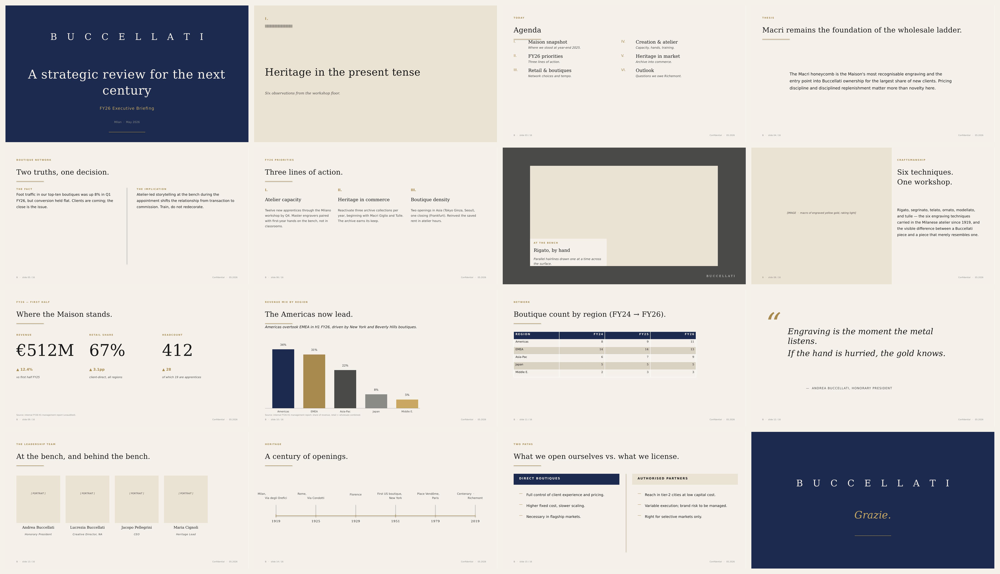
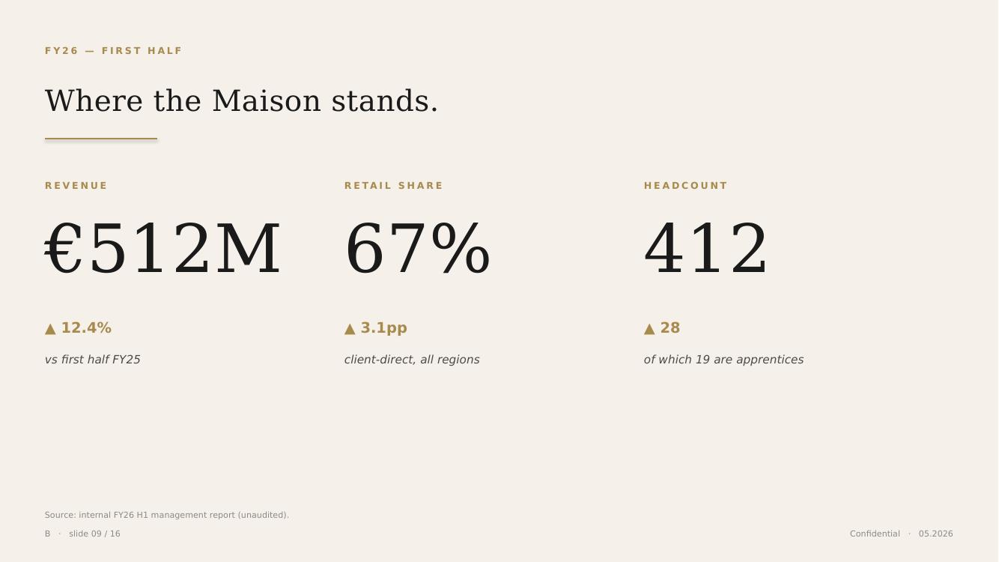
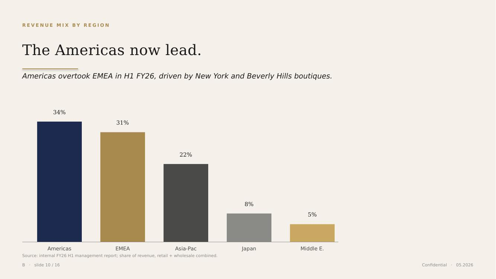
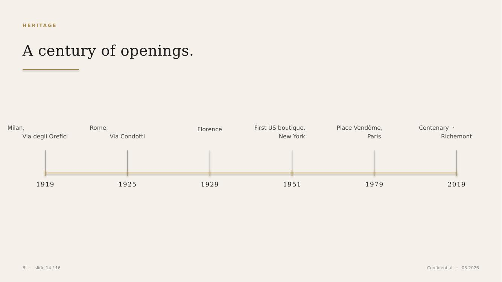

# Buccellati Executive Presentation Design System

> A reusable, executive-grade PowerPoint design system for the Milanese
> high-jewellery Maison — engineered so a CEO-level deliverable can be
> produced by Claude, ChatGPT, or Gemini and stay unmistakably Buccellati.

<p align="center">
  
</p>

<p align="center">
  <em>Sixteen slide layouts, one Maison.</em>
</p>

---

## What this is

A complete, version-controlled design system for Buccellati internal
leadership communication — strategic reviews, board updates, market
presentations, brand decks, CEO-level deliverables.

It contains:

| Folder            | What lives there                                                                 |
| ----------------- | -------------------------------------------------------------------------------- |
| `docs/`           | Long-form guidelines split by topic — colour, typography, layout, motifs, voice  |
| `tokens/`         | Canonical W3C-spec design tokens (`tokens.json`) — single source of truth        |
| `css/` / `scss/`  | Flat CSS custom properties and Sass variables for the web preview & micro-sites  |
| `powerpoint/`     | Python generator that produces `.potx` + a 16-slide sample `.pptx`               |
| `assets/svg/`     | Proprietary ornaments — honeycomb/tulle, rigato rule, B monogram, "Since 1919"   |
| `examples/`       | A self-contained HTML preview that renders the system in the browser            |
| `ai-prompts/`     | Copy-paste prompts that brief Claude / ChatGPT / Gemini to generate compliant decks |

## What this is *not*

- Not a public brand book. Buccellati's bespoke Typotheque typeface and the
  official Pantone palette are proprietary. This system uses approximations
  derived from publicly observable assets; replace them with the official
  values when you have access.
- Not a Richemont group identity system. Any co-branded deliverable falls
  under Richemont's brand standards, not this document.
- Not a marketing system. This is for *internal* executive communication.

---

## Quick start

### Generate the `.potx`

```bash
cd powerpoint
pip install python-pptx
python generate_potx.py
# Writes:
#   out/Buccellati_Executive.potx   — the template
#   out/Buccellati_Sample.pptx      — a 16-slide demo
```

Open the `.potx` in PowerPoint, then **File → Save As → PowerPoint
Template** to bind the template content-type for your IT estate.

### Brief Claude / ChatGPT / Gemini

Paste the entirety of [`ai-prompts/system-prompt.md`](ai-prompts/system-prompt.md)
into your AI of choice. Attach your raw briefing material. The model will
generate a Buccellati-compliant deck.

### Preview in the browser

Open [`examples/preview.html`](examples/preview.html) — every layout renders
at 1:1 print proportions using the CSS in `css/buccellati.css`.

---

## The system at a glance

### Colour

A monochrome ivory-and-black backbone with a single regal blue and a warm
matte gold. **No green, no red, no saturated digital colour anywhere.**

| Token              | Hex       | Role                                       |
| ------------------ | --------- | ------------------------------------------ |
| Avorio             | `#F5F1EA` | Default slide background (never `#FFFFFF`) |
| Nero Inchiostro    | `#1A1A1A` | Primary text (never `#000000`)             |
| Blu Buccellati     | `#1B2A4E` | Cover / section / closing — and one accent |
| Oro Antico         | `#A8894E` | Hairlines, eyebrows, positive deltas       |
| Pergamena          | `#EAE2D2` | Section-divider alternate background       |

Full palette and chart-series order: [`docs/01-colour.md`](docs/01-colour.md).

### Typography

| Role     | Primary           | Universal fallback                          |
| -------- | ----------------- | ------------------------------------------- |
| Display  | Trajan Pro        | Cormorant Garamond Light                    |
| Heading  | Cormorant Garamond| Garamond → Georgia                          |
| Body     | Optima            | Gill Sans MT → Calibri Light                |
| Data     | (tabular)         | Georgia, tabular figures                    |

The fallback stack uses fonts that ship with Microsoft 365 on both Windows
and Mac, so the deck renders correctly on any laptop in the Maison.

Full type scale, tracking, and embedding rules:
[`docs/02-typography.md`](docs/02-typography.md).

### Layout

- 16:9 widescreen, 13.333" × 7.5"
- 0.6" outer margin on all four sides
- 12-column grid, 0.94" columns, 0.18" gutters
- A slide is no more than **40% inked**. Empty space is a Buccellati signal.

### Sixteen named layouts

01 Cover · 02 Section · 03 Agenda · 04 Statement · 05 Two-column ·
06 Three-column · 07 Image-led · 08 Image + Text 60/40 · 09 KPI dashboard ·
10 Chart · 11 Table · 12 Pull-quote · 13 Team / Org · 14 Timeline ·
15 Comparison · 16 Closing

Full spec per layout: [`docs/04-layouts.md`](docs/04-layouts.md).

### Selected previews

<table>
  <tr>
    <td><br><em>01 Cover</em></td>
    <td><br><em>09 KPI dashboard</em></td>
  </tr>
  <tr>
    <td><br><em>10 Chart</em></td>
    <td><br><em>14 Timeline</em></td>
  </tr>
</table>

---

## Repository layout

```
buccellati-design-system/
├── README.md                       ← you are here
├── LICENSE                         ← MIT for code; brand assets are proprietary
├── CHANGELOG.md
├── CONTRIBUTING.md
├── tokens/
│   └── tokens.json                 ← W3C design tokens (canonical)
├── css/
│   ├── variables.css               ← flat CSS custom properties
│   └── buccellati.css              ← production stylesheet
├── scss/
│   └── _variables.scss             ← Sass mirror
├── powerpoint/
│   ├── generate_potx.py            ← python-pptx generator
│   ├── requirements.txt
│   └── out/                        ← .potx + sample .pptx land here
├── assets/
│   ├── svg/                        ← honeycomb, rigato, B monogram, "Since 1919"
│   └── fonts/                      ← (drop OTF/TTF here when licensed)
├── docs/
│   ├── 01-colour.md
│   ├── 02-typography.md
│   ├── 03-imagery.md
│   ├── 04-layouts.md
│   ├── 05-motifs-and-logo.md
│   ├── 06-voice-and-tone.md
│   ├── 07-accessibility.md
│   ├── 08-do-and-dont.md
│   └── images/                     ← preview renders for docs
├── examples/
│   └── preview.html                ← self-contained HTML preview
├── ai-prompts/
│   ├── system-prompt.md            ← the long form prompt
│   ├── quick-prompt.md             ← short version for chat models
│   └── slide-recipes.md            ← per-layout briefing recipes
└── .github/
    └── workflows/
        └── ci.yml                  ← regenerates the .potx on every push
```

---

## Versioning & maintenance

- **Semantic versioning** — see [`CHANGELOG.md`](CHANGELOG.md).
- **Single source of truth** — `tokens/tokens.json`. CSS, SCSS, and the
  Python generator all derive from it.
- **Annual review** — re-validate against any Buccellati brand updates and
  Richemont group identity changes.
- **Quality gate** — every deck that leaves the Maison runs: spell-check,
  PowerPoint Accessibility Checker, font embedding pass, source-citation
  pass, and the "would this feel at home next to a Macri bracelet in a
  boutique window?" gut-check.

---

## Caveats

The brand-derivation caveats from the original brief still apply:

1. The hex values for Blu Buccellati and Oro Antico are **derived
   approximations**, codified from the Maison's octagonal blue silk box
   with gold-printed logo. If a confidential Buccellati brand book exists
   internally, replace these with the official values in `tokens/tokens.json`
   and rebuild.
2. The bespoke Typotheque face is **licensed**. The Garamond / Gill Sans /
   Georgia fallback stack is the safe production default.
3. Direct CSS extraction from `buccellati.com` was not possible (Magento +
   Jakala theme; stylesheets are not openly fetchable). Confirm the system
   against the live site's computed styles before final production.
4. The 1951 vs 1954 New York opening conflict is preserved: use "first US
   boutique, New York, 1951" until the Maison's heritage team confirms.
5. Richemont co-branding is governed by group standards, not this document.

---

## Credits

Visual direction derived from publicly observable Buccellati brand assets
(`buccellati.com`, `richemont.com`), Typotheque's documentation of the
Buccellati bespoke typeface, Peter Biľak's "The history of History" article,
the Maison's documented craftsmanship vocabulary (*rigato, segrinato,
telato, ornato, modellato, tulle*), and the design conventions of
executive presentations at Richemont group Maisons.

## License

Code in this repository is released under the MIT License — see
[`LICENSE`](LICENSE). The Buccellati name, wordmark, "Since 1919" lockup,
and any official brand assets remain the intellectual property of Buccellati
and Compagnie Financière Richemont SA. Nothing in this repository grants any
right to those assets.
