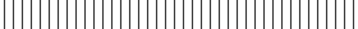
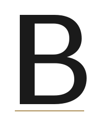

# 05 · Motifs & logo

> Buccellati's craft vocabulary is the Maison's visual language. The
> ornaments below derive directly from the engraving techniques that have
> lived in the Milanese atelier since 1919. Use them sparingly — the
> Maison is quieter than its content.

## Signature craft vocabulary

These are the six techniques that define a Buccellati piece. Use the
*words* as terminology in slide copy, and the *patterns* as inspiration
for ornament — but only when the meaning justifies it.

| Technique     | What it is                                                                  | How we use it visually                                                |
| ------------- | --------------------------------------------------------------------------- | --------------------------------------------------------------------- |
| **Rigato**    | Fine parallel lines, silk-like sheen                                        | Horizontal divider rule motif (the "rigato rule" — see below)         |
| **Segrinato** | Dense crossed-and-overlapping engraving, velvet effect                      | Reserved for ornament; do not use as background                       |
| **Telato**    | Cross-hatched right-angle engraving, linen / canvas texture                 | Subtle background tile at 4–6% opacity max (rare)                     |
| **Ornato**    | Brocade-like floral overlay on a rigato ground                              | Reserved for high-ceremony cover slides only                          |
| **Modellato** | Three-dimensional high-relief engraving, typically on borders               | Inspiration for the slight raised quality of headings — visual mood   |
| **Tulle**     | Hexagonal openwork piercing — the most identifiable Buccellati motif        | Section-divider graphic (the "honeycomb" ornament — see below)        |

## The proprietary ornaments

Three drawn ornaments live in [`assets/svg/`](../assets/svg/). All three are
**outline only** in Oro Antico — never filled. They are punctuation marks,
not backgrounds.

### Honeycomb (tulle)

The Maison's most recognisable ornament. A seven-cell hex flower, pointy-top.

- **File:** `assets/svg/honeycomb-tulle.svg`
- **Size on slide:** 1.5" diameter on Section slides; 0.6" on closing slides;
  0.4" as a page-number badge (rare)
- **Stroke:** 0.5pt, Oro Antico `#A8894E`
- **Rules:**
  - Outline only — never filled with colour
  - Never used as a repeating background pattern across an entire slide
  - One per section, maximum

  

### Rigato rule

Forty fine vertical hairlines forming a 1.5"-wide horizontal band — silk
threads on the page.

- **File:** `assets/svg/rigato-rule.svg`
- **Size on slide:** 1.5" wide × 0.12" tall band
- **Stroke:** 0.5pt, Nero Inchiostro
- **Rules:**
  - Used as a section break beneath a slide title
  - Never used decoratively — always functional
  - One per section, maximum

  

### B monogram

A discreet footer mark for content slides. The full wordmark is reserved
for **Cover (01)**, **Section Divider (02)**, **Image-led (07)**, and
**Closing (16)** — never on every content slide.

- **File:** `assets/svg/b-monogram.svg`
- **Size on slide:** 0.3" tall in the footer
- **Color:** Nero Inchiostro on light backgrounds; Avorio on Blu Buccellati

  

### "Since 1919" lockup

- **File:** `assets/svg/since-1919.svg`
- **Use only on cover slides and closing slides** — never on every content slide

  

## The wordmark

"BUCCELLATI" in the Typotheque-bespoke face is the primary mark. **Always
use the official SVG / PNG — never re-type the word in another font.**

### Clear space

Minimum clear space around the wordmark equals the **height of one "B"
character** in the mark, on all sides.

### Minimum size on slide

| Context             | Width  |
| ------------------- | ------ |
| Cover slide         | 2.2"   |
| Closing slide       | 2.4"   |
| Footer / corner mark on content slides | 0.9" (never smaller) |

### Color treatment

- **On Avorio background:** wordmark in Nero Inchiostro `#1A1A1A`
- **On Blu Buccellati background:** wordmark in Avorio `#F5F1EA` — **never** in pure white
- **On photography:** wordmark in Avorio, only over the darkest 30% of the
  image. If no dark area exists, place the mark below the image in the
  slide gutter.

### What never happens to the logo

- No rotation, no shadow, no glow, no stretch, no gradient fill
- No "powered by" or co-branding lockups (Richemont co-branding follows
  separate Richemont group guidelines)
- No background colour other than Avorio, Pergamena, or Blu Buccellati
- No repetition on every content slide — use the small "B" monogram footer

## Iconography (for functional icons in KPIs / process diagrams)

When functional icons are required:

- **Style:** thin-line only, 1.5pt stroke, no fill
- **Colour:** Nero Inchiostro or Oro Antico
- **Recommended library:** [Phosphor Thin](https://phosphoricons.com/) or
  [Feather Icons](https://feathericons.com/) — both have Microsoft-compatible
  SVGs and a uniformly minimal aesthetic
- **Never use:** coloured icons, 3D icons, isometric illustrations,
  Microsoft 365 default emoji-style icons
